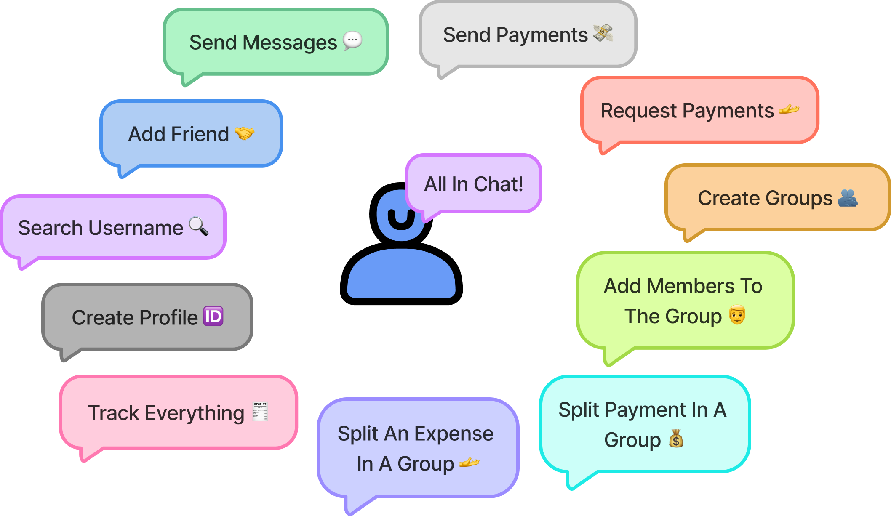

# FundMate
FundMate is a decentralized social payment and messaging platform built on the Aptos blockchain. It combines secure communication, seamless cryptocurrency payments, and group functionality, all within a user-friendly chat interface. It's designed to make chatting with friends, splitting bills, sending and requesting money as easy as posting a status update.

## What you can do with it?

## One-to-One

## Tools used

- Next.js
- shadcn/ui + tailwind for styling
- Aptos TS SDK
- Aptos Wallet Adapter
- Node based Move commands

## What Move commands are available?

The tool utilizes [aptos-cli npm package](https://github.com/aptos-labs/aptos-cli) that lets us run Aptos CLI in a Node environment.

Some commands are built-in the template and can be ran as a npm script, for example:

- `npm run move:publish` - a command to publish the Move contract
- `npm run move:test` - a command to run Move unit tests
- `npm run move:compile` - a command to compile the Move contract
- `npm run move:upgrade` - a command to upgrade the Move contract
- `npm run deploy` - a command to deploy the dapp to Vercel

For all other available CLI commands, can run `npx aptos` and see a list of all available commands.
