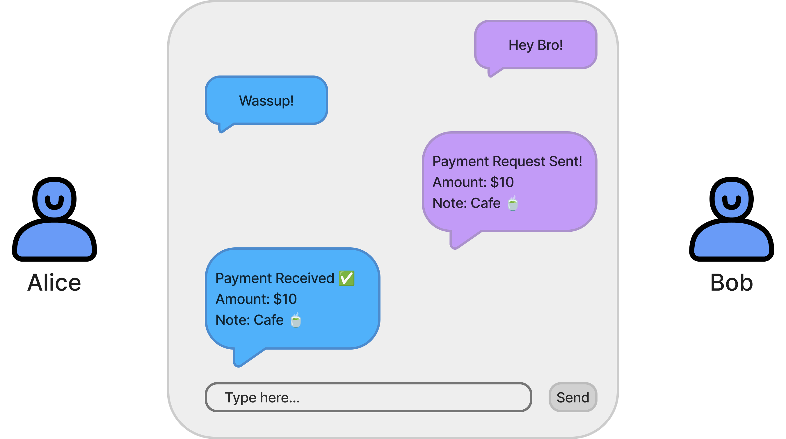
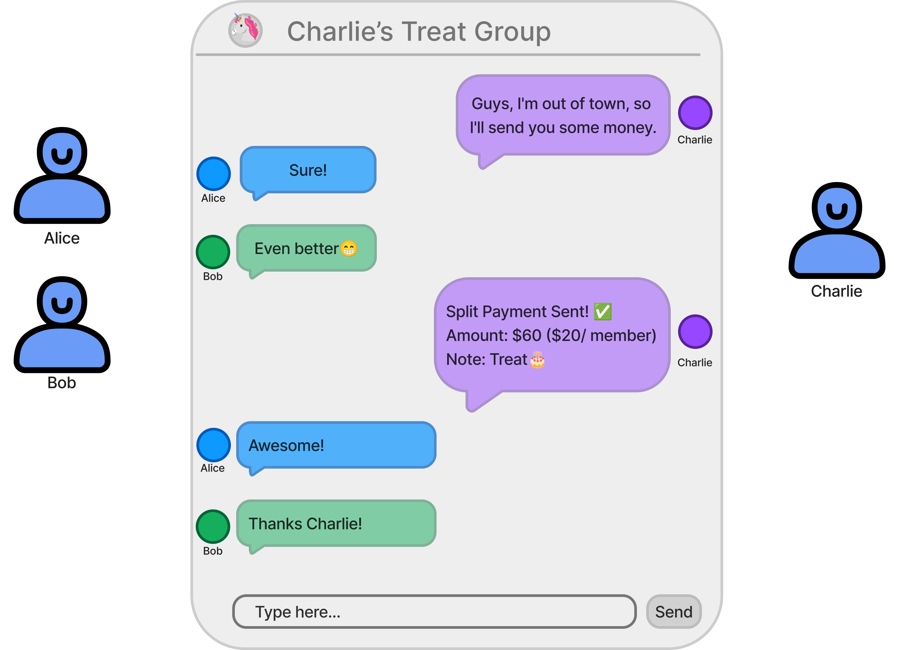

# FundMate
FundMate is a decentralized social payment and messaging platform built on the Aptos blockchain. It combines secure communication, seamless cryptocurrency payments, and group functionality, all within a user-friendly chat interface. It's designed to make chatting with friends, splitting bills, sending and requesting money as easy as posting a status update.

## What you can do with it?

1. **Create ID**: Create your profile with a unique username using the `create_id` function.
2. **Connect**: Add friends to your network with the `add_friend` function.
3. **Chat**: Start conversations and send messages or money using `send_message`.
4.  **Send Payments**: Individual payments are made using `send_payment`, which transfers Aptos Coins and records the transaction in both users' conversation histories.
5. **Group Up**: Create groups for different purposes using `create_group` and add members.
6. **Add members**: Add members to the group using `add_member_to_group_by_address`  or `add_member_to_group_by_username. 
7. **Split Bills**: In groups, use `send_group_payment` to automatically divide payments among members.
8. **Request Funds**: Send payment requests to friends using `request_payment`.
9. **Track Everything**: Access your conversation and transaction history through various view functions. And see detailed analytics

## One-to-One

## Groups

## Tools used

- Next.js
- shadcn/ui + tailwind for styling
- Aptos TS SDK
- Aptos Wallet Adapter
- Node based Move commands

## What Move commands are available?

The tool utilizes [aptos-cli npm package](https://github.com/aptos-labs/aptos-cli) that lets us run Aptos CLI in a Node environment.

Some commands are built-in the template and can be ran as a npm script, for example:

- `npm run move:publish` - a command to publish the Move contract
- `npm run move:test` - a command to run Move unit tests
- `npm run move:compile` - a command to compile the Move contract
- `npm run move:upgrade` - a command to upgrade the Move contract
- `npm run deploy` - a command to deploy the dapp to Vercel

For all other available CLI commands, can run `npx aptos` and see a list of all available commands.
